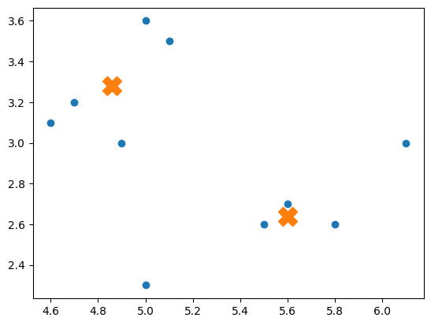

# 第4回 - はじめての機械学習 - クラスタリング

## k-Means

* k-Means法は非階層型クラスタリングアルゴリズムの一つ
* 教師なし学習の手法で、データを指定されたk個のクラスタに分ける
* k個のデータポイントをクラスタ中心として選択し、それを基にデータのグループ化する

> クラスタ（Cluster）とは集団を意味する言葉です。クラスタリングは教師データを使わずに、データの傾向を分析して、データにラベル付けします。



## プログラミング

1. irisデータセットをロードする
2. ~~訓練データ、テストデータに分割する~~
3. k-Meansで学習する（モデルを作成する）
4. モデル内に生成されたクラスタラベルを確認する
5. (モデルを使って推論する)
6. ~~モデルを評価する~~

> 教師なし学習では、答えとなるデータがないので、訓練データとテストデータを分割しません。またモデル学習時に、学習データに対してラベリング（ラベル付け）します。

---

### 1. irisデータセットをロードする

```python
from sklearn import datasets

iris = datasets.load_iris()
data = iris.data
```

### 3. k-Meansで学習する（モデルを作成する）

```py
from sklearn.cluster import KMeans

model = KMeans(n_clusters=3)
model.fit(data)
```

### 4. モデル内に生成されたクラスタラベルを確認する

```py
labels = model.labels_
print(labels)
```

#### 散布図で可視化する

```py
import matplotlib.pyplot as plt

plt.scatter(data[:, 0], data[:, 1], c=labels)
plt.xlabel(iris.feature_names[0])
plt.ylabel(iris.feature_names[1])
plt.scatter(model.cluster_centers_[:, 0], model.cluster_centers_[:, 1], s=300, marker='X')

plt.show()
```

### 5. (モデルを使って推論する)

```py
new_data = [[5.1, 3.5, 1.4, 0.2], [6.7, 3.0, 5.2, 2.3]]
predicted_labels = model.predict(new_data)
print(predicted_labels)
```
